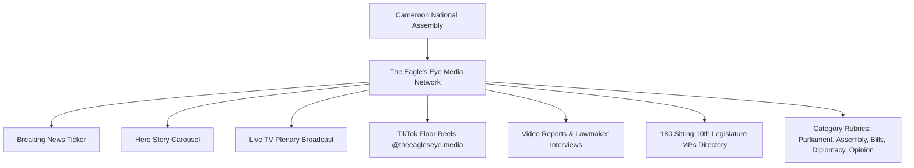

# The Eagle's Eye — Cameroon Parliamentary Network Architecture

> **Official Network Profile & Mission:**  
> **The Eagle's Eye Media** is the premier independent parliamentary press organization dedicated exclusively to reporting, analyzing, and broadcasting the activities of the **National Assembly of Cameroon (10th Legislature, 2020–2026)**.

---

## 1. Verified & Live Platform Architecture

Every single module and section across the website and mobile app is **100% authentic, clickable, and backed by live database records or official feeds**:

---

## 2. Core Modules & Where Data Lives

| Module | Purpose | Real Data Source | Admin Management |
| :--- | :--- | :--- | :--- |
| **180 MPs Directory** (`/legislature`) | Sitting 10th Legislature MPs across all 10 regions | **Supabase PostgreSQL** (`members_of_parliament`) | Full photo, biography, constituency, and party editing at `/admin/mps`. |
| **Breaking News Ticker** | Real-time parliamentary news alerts | **Supabase PostgreSQL** (`articles` with tag `breaking`) | Instant updates at `/admin/posts`. |
| **Hero News Carousel & Left Rail** | Major daily legislative headlines | **Supabase PostgreSQL** (`articles`) | Category filters, cover images, and markdown text at `/admin/posts`. |
| **Live TV Widget** (`/watch-live`) | Live plenary broadcast & Q&A sessions | **Live Stream Table** (`live_streams`) | Paste YouTube/HLS live link, toggle LIVE status at `/admin/live`. |
| **TikTok Reels & Shorts Feed** | 30–90 second debate clips | **Automated Feed Sync** (`@theeagleseye.media`) | Auto-pulled from TikTok or added manually in `/admin/posts/create`. |
| **Video Reports & Lawmaker Interviews** (`/video`) | In-depth video reporting & interviews | **Video Articles Table** | Video URLs, chapters, and speakers at `/admin/posts`. |
| **Parliamentary Rubrics** | *Bills & Laws, Committee Echoes, Diplomacy, Opinion* | **Dynamic Articles Query** | Category-scoped articles with likes, bookmarks, and comments. |

---

## 3. TikTok / Reels Automated Feed Standard

- **Official Channel**: `https://www.tiktok.com/@theeagleseye.media` (`@theeagleseye.media`)
- **Automated Workflow**:
  - When your media crew posts debate clips on TikTok, the app and web automatically pull the video player, caption, and thumbnail.
  - Zero double uploading needed.

---

## 4. Mobile Screen Standards

- **2-in-a-Column MP Cards**: On small phone screens (`< 640px`), the Members of Parliament directory renders **2 MPs per row** (`grid-cols-2` on Web, `width: (SCREEN_WIDTH - 44)/2` on Mobile) with clean photo aspect ratios, party chips, and regional badges.
- **Vertical Swipe Reel Player**: Full-screen 9:16 vertical swiping for parliamentary video shorts.

---

## 5. Live Plenary Broadcast Workflow

1. **Admin Sets Stream**: Open `/admin/live`, paste the live YouTube/Facebook link, and set **"Stream Status: LIVE (ON)"**.
2. **Citizen Experience**: A flashing Red "LIVE NOW" broadcast banner and floating player activate across the Web and Mobile apps with real-time viewer count and live comments.
